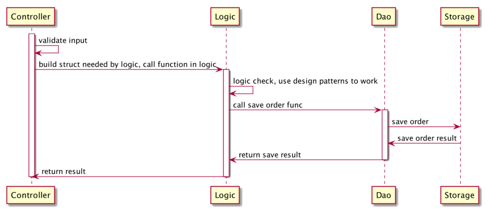
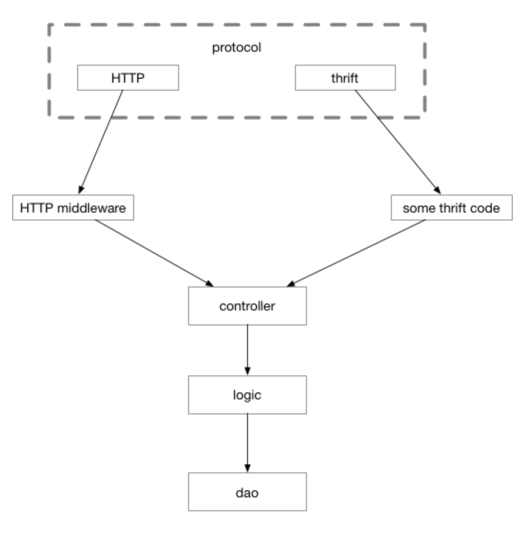

# Gin-based Microservice Demo

In this demo, we will use Gin to build a simple cooking application.We will cover how to integrate,deploy,and test the app using the Gin framework.The application will do the following:
* Display the recipes that are submitted by the users, along with their ingredients and instructions.
* Allow anyone to post a new recipe.

## Prerequisites
* go 1.18+
* a MongoDB instance
  * You can use the MongoDB as a Service solution, known as MongoDB Atlas (https://www.mongodb.com/cloud/atlas), to run a free 500 MB database on the cloud. You can deploy a fully managed MongoDB server on AWS, Google Cloud Platform, or Microsoft Azure. 
  * You can run MongoDB locally with a containerization solution such as Docker. Multiple Docker images are available on DockerHub with a MongoDB server configured and ready to use out of the box.

## Layout 项目分层
> Layout部分参考了`Go语言高级编程中5.7章节`的示例，书籍可以在此项目的`doc/ebook`目录下查看

流行的Web框架大多数是MVC框架，MVC这个概念最早在1978年提出，为了能够对GUI类型的应用进行方便扩展，将程序划分为：
* `控制器（Controller）` - 负责转发请求，对请求进行处理。
* `视图（View）` - 界面设计人员进行图形界面设计。
* `模型（Model）` - 程序员编写程序应有的功能（实现算法等等）、数据库专家进行数据管理和数据库设计（可以实现具体的功能）。

随着时代的发展，前端也变成了越来越复杂的工程，为了更好地工程化，现在更为流行的一般是前后分离的架构。可以认为前后分离是把V层从MVC中抽离单独成为项目。这样一个后端项目一般就只剩下 M和C层了。

对于复杂的项目，一个C和一个M层显然是不够用的，现在比较流行的纯后端API模块一般采用下述划分方法：
* `Controller`，与上述类似，服务入口，负责处理路由，参数校验，请求转发。
* `Logic/Service`，逻辑（服务）层，一般是业务逻辑的入口，可以认为从这里开始，所有的请求参数一定是合法的。业务逻辑和业务流程也都在这一层中。常见的设计中会将该层称为 Business Rules。
* `DAO/Repository`，这一层主要负责和数据、存储打交道。将下层存储以更简单的函数、接口形式暴露给`Logic`层来使用。负责数据的持久化工作。”

每一层都会做好自己的工作，然后用请求当前的上下文构造下一层工作所需要的结构体或其它类型参数，然后调用下一层的函数。在工作完成之后，再把处理结果一层层地传出到入口，如图下图所示：

划分为CLD三层之后，在C层之前我们可能还需要同时支持多种协议。本章前面讲到的thrift、gRPC和http并不是一定只选择其中一种，有时我们需要支持其中的两种，比如同一个接口，我们既需要效率较高的thrift，也需要方便debug的http入口。即除了CLD之外，还需要一个单独的protocol层，负责处理各种交互协议的细节。这样请求的流程会变成下图所示：

可以认为，我们的代码运行到Controller层之后，就没有任何与“协议”相关的代码了。在这里你找不到`http.Request`，也找不到`http.ResponseWriter`，也找不到任何与`thrift`或者`gRPC`相关的字眼。

## DI 依赖注入

